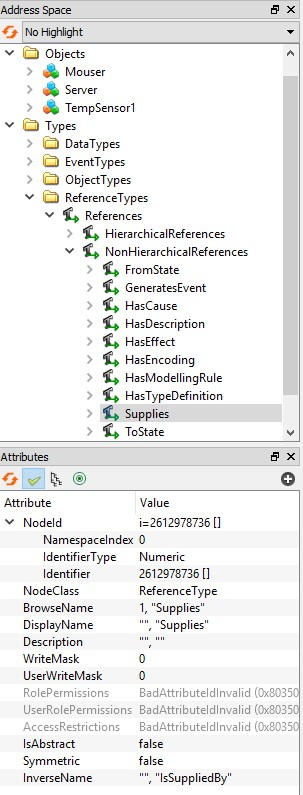
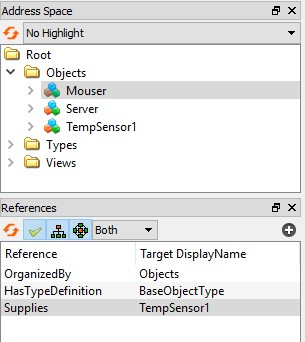
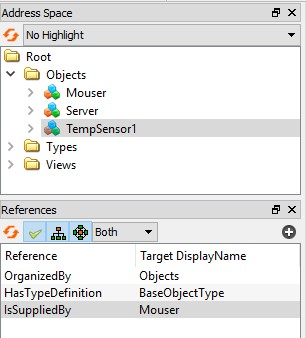
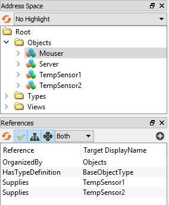

# References

OPC UA supports the concept of *References* to create relations between *Nodes*. References are categorised in *HierarchicalReferences* and *NonHierarchicalReferences*. The *HierarchicalReferences* are the ones used by most OPC Clients to display the instances tree in their graphical user interfaces.

When adding an instance using the *QUaServer* API, the library creates the required *HierarchicalReference* type necessary to display the new instance in the instances tree (it uses the *HasComponent*, *HasProperty* or *Organizes* reference types accordingly).

The *QUaServer* API also allows to create **custom** *NonHierarchicalReferences* that can be used to create custom relations between instances. For example, having a temperature sensor and then define a supplier for that sensor:

```c++
// create sensor
QUaBaseObject * objSensor1 = objsFolder->addBaseObject("TempSensor1");
// create supplier
QUaBaseObject * objSupl1 = objsFolder->addBaseObject("Mouser");
// create reference
server.registerReferenceType({ "Supplies", "IsSuppliedBy" });
objSupl1->addReference({ "Supplies", "IsSuppliedBy" }, objSensor1);
```

The `registerReferenceType()` method *registers* the new reference type as a *subtype* of the *NonHierarchicalReferences*. If the reference type is not registered before its first use, it is registered automatically by `addReference()`. Optionally, a custom `NodeId` for the reference type can be passed as the second argument. The `referenceTypes()` and `referenceTypeRegistered()` methods list and check the registered reference types.

The registered reference can be observed when the server is running by browsing to `/Root/Types/ReferenceTypes/NonHierarchicalReferences`. There should be a new entry corresponding to the custom reference.

<p align="center">
  
</p>

The references for the supplier object should list the *Supplies* reference:

<p align="center">
  
</p>

The references for the sensor object should list the *IsSuppliedBy* reference:

<p align="center">
  
</p>

The `registerReferenceType()` method receives a `QUaReferenceType` instance as an argument, which is defined as:

```c++
struct QUaReferenceType
{
	QString strForwardName;
	QString strInverseName;
};
```

Both **forward** and **reverse** names of the reference have to be defined in order to create the reference. In the example, `Supplies` is the *forward* name, and `IsSuppliedBy` is the reverse name. When adding a reference, by default, it is added in *forward* mode. This can be changed by adding a third argument to the `addReference()` method which is `true` by default to indicate it is *forward*, `false` to indicate it is *reverse*. 

```c++
// objSupl1 "Supplies" objSensor1
objSupl1->addReference({ "Supplies", "IsSuppliedBy" }, objSensor1, true);
// objSensor2 "IsSuppliedBy" objSupl1
objSensor2->addReference({ "Supplies", "IsSuppliedBy" }, objSupl1, false);
```

In the example above, both sensors are supplied by the same supplier:

<p align="center">
  
</p>

Programmatically, references can be added, removed and browsed using the following *QUaNode* API methods:

```c++
void addReference(const QUaReferenceType &refType, QUaNode *nodeTarget, const bool &isForward = true);

void removeReference(const QUaReferenceType &refType, QUaNode *nodeTarget, const bool &isForward = true);

template<typename T>
QList<T*>       findReferences(const QUaReferenceType &refType, const bool &isForward = true) const;
// specialization
QList<QUaNode*> findReferences(const QUaReferenceType &refType, const bool &isForward = true) const;
```

For example, to list all the sensors that are supplied by the supplier:

```c++
qDebug() << "Supplier" << objSupl1->displayName() << "supplies :";
auto listSensors = objSupl1->findReferences<QUaBaseObject>({ "Supplies", "IsSuppliedBy" });
for (int i = 0; i < listSensors.count(); i++)
{
	qDebug() << listSensors.at(i)->displayName();
}
```

And to list the supplier of a sensor:

```c++
qDebug() << objSensor1->displayName() << "supplier is :";
auto listSuppliers = objSensor1->findReferences<QUaBaseObject>({ "Supplies", "IsSuppliedBy" }, false);
qDebug() << listSuppliers.first()->displayName();
```

Note that when a *QUaNode* derived instance is deleted, all its references are removed.

To notify when a reference has been added or removed the *QUaNode* API has the following *Qt signals*:

```c++
void referenceAdded  (const QUaReferenceType &refType, QUaNode *nodeTarget, const bool &isForward);
void referenceRemoved(const QUaReferenceType &refType, QUaNode *nodeTarget, const bool &isForward);
```

## References Example

Build and run the [03_references](../examples/03_references/main.cpp) example to learn more.
