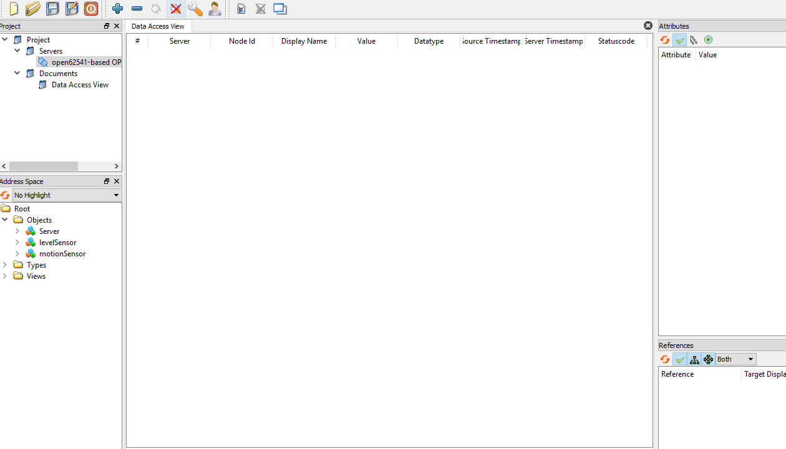
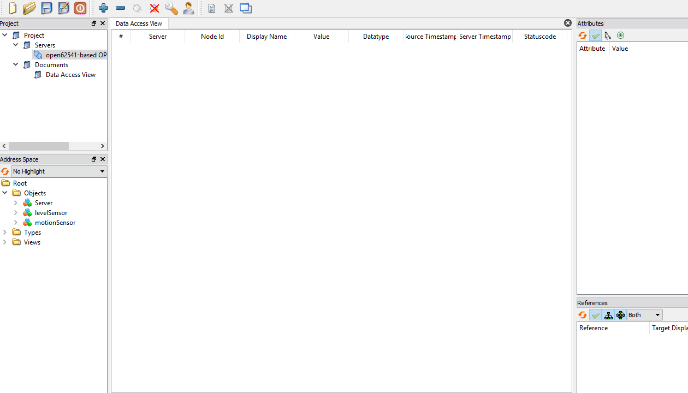

# Alarms

At the time of writing, alarms and conditions are considered an `EXPERIMENTAL` feature in the *open62541* library, therefore the same applies for *QUaServer*. Please use with caution.

To use alarms and conditions, configure the project with the `QUASERVER_ALARMS_CONDITIONS` option. It automatically enables events (`QUASERVER_EVENTS`) and the full namespace zero, so *open62541* is built with `UA_NAMESPACE_ZERO=FULL`, `UA_ENABLE_SUBSCRIPTIONS_EVENTS=ON` and `UA_ENABLE_SUBSCRIPTIONS_ALARMS_CONDITIONS=ON`:

```bash
cmake -S . -B build -DCMAKE_PREFIX_PATH=<path to Qt6> -DQUASERVER_ALARMS_CONDITIONS=ON
cmake --build build
```

Note that the binaries are now considerably larger because they contain the full default OPC UA address space.

Two types of alarms are available out of the box by the `QUaServer` API:

* `QUaOffNormalAlarm` : Used for alarms based on discrete values. Useful not only for alarms based on *boolean* values, but also any other discrete values such as *integers*.

* `QUaExclusiveLevelAlarm` : Used for alarms based in continuous numeric values. It provides automatic level checking.

## QUaOffNormalAlarm

To create a `QUaOffNormalAlarm`, the first step is to create an object that will be the `SourceNode` of the events triggered by the alarm. Clients will be then able to subscribe to events emitted by this object in order to track the alarm state.

```c++
auto motionSensor = objsFolder->addChild<QUaBaseObject>("motionSensor");
```

Then a variable is needed that will provide the discrete value that the alarm will monitor. Any variable that contains a discrete value can be used.

```c++
auto moving = motionSensor->addBaseDataVariable("moving");
moving->setWriteAccess(true);
moving->setDataType(QMetaType::Bool);
moving->setValue(false);
```

Finally the `QUaOffNormalAlarm` can be created based on its `SourceNode`, setting the variable with the discrete value as an `InputNode` and defining what the *Normal Value* of the `InputNode` should be.

```c++
auto motionAlarm = motionSensor->addChild<QUaOffNormalAlarm>("alarm");
motionAlarm->setConditionName("Motion Sensor Alarm");
motionAlarm->setInputNode(moving);
motionAlarm->setNormalValue(false);
motionAlarm->setConfirmRequired(true);
```

For the alarm to start generating events, first it has to be **enabled**. This can be done by calling the `Enable` method of the alarm object through the network using an OPC client or programmatically using the C++ `Enable()` method.

<p align="center">
  
</p>

## QUaExclusiveLevelAlarm

To create a `QUaExclusiveLevelAlarm`, the first step is to create an object that will be the `SourceNode` of the events triggered by the alarm. Clients will be then able to subscribe to events emitted by this object in order to track the alarm state.

```c++
auto levelSensor = objsFolder->addChild<QUaBaseObject>("levelSensor");
```

Then a variable is needed that will provide the continuous value that the alarm will monitor. Any variable that contains a continuous value can be used.

```c++
auto level = levelSensor->addBaseDataVariable("level");
level->setWriteAccess(true);
level->setDataType(QMetaType::Double);
level->setValue(0.0);
```

Then the `QUaExclusiveLevelAlarm` can be created based on its `SourceNode`, setting the variable with the continuous value as an `InputNode`. 

```c++
auto levelAlarm = levelSensor->addChild<QUaExclusiveLevelAlarm>("alarm");
levelAlarm->setConditionName("Level Sensor Alarm");
levelAlarm->setInputNode(level);

levelAlarm->setHighLimitRequired(true);
levelAlarm->setLowLimitRequired(true);
levelAlarm->setHighLimit(10.0);
levelAlarm->setLowLimit(-10.0);
```

By default the `QUaExclusiveLevelAlarm` does not monitor any limits, so they have to be required explicitly using the `QUaExclusiveLevelAlarm` API:

```c++
// to enabled the monitoring of specific limits
void setHighHighLimitRequired(const bool& highHighLimitRequired);
void setHighLimitRequired    (const bool& highLimitRequired    );
void setLowLimitRequired     (const bool& lowLimitRequired     );
void setLowLowLimitRequired  (const bool& lowLowLimitRequired  );

// to define the limits
double highHighLimit() const;
void setHighHighLimit(const double& highHighLimit);

double highLimit() const;
void setHighLimit(const double& highLimit);

double lowLimit() const;
void setLowLimit(const double& lowLimit);

double lowLowLimit() const;
void setLowLowLimit(const double& lowLowLimit);
```

For the alarm to start generating events, first it has to be **enabled**. This can be done by calling the `Enable` method of the alarm object through the network using an OPC client or programmatically using the C++ `Enable()` method.

<p align="center">
  
</p>

## Branches

Support for [branches](https://reference.opcfoundation.org/v104/Core/docs/Part9/5.5.3/) in `QUaServer` is disabled by default. To enable branches call the `setBranchQueueSize` method with a value larger than `0`. This will create a branch queue in the alarm which will keep the given number of branches in memory. If more branches are created than the size of the queue, the oldest branch will be deleted automatically to avoid memory saturation.

```c++
motionAlarm->setBranchQueueSize(10);
levelAlarm->setBranchQueueSize(10);
```

Historizing of branches is also disabled by default, to enable it, call the `setHistorizingBranches` method with a `true` value.

```c++
motionAlarm->setHistorizingBranches(true);
levelAlarm->setHistorizingBranches(true);
```
